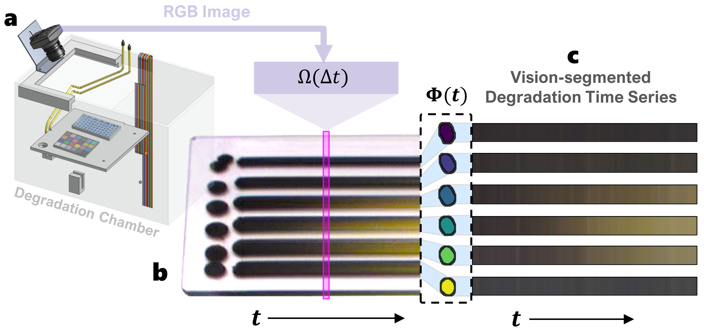
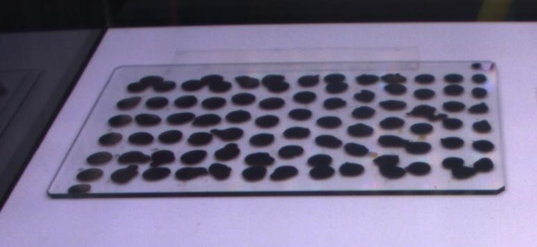
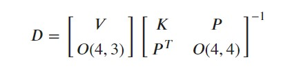
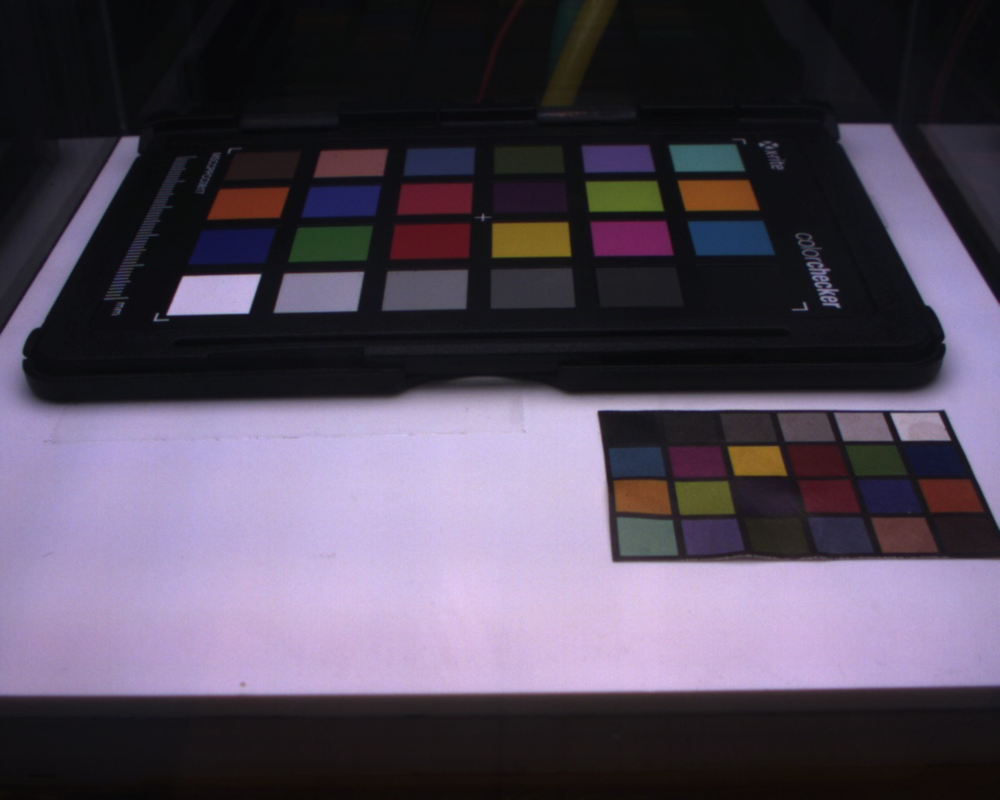
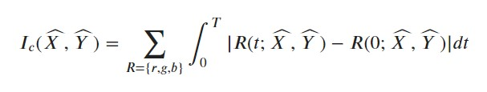
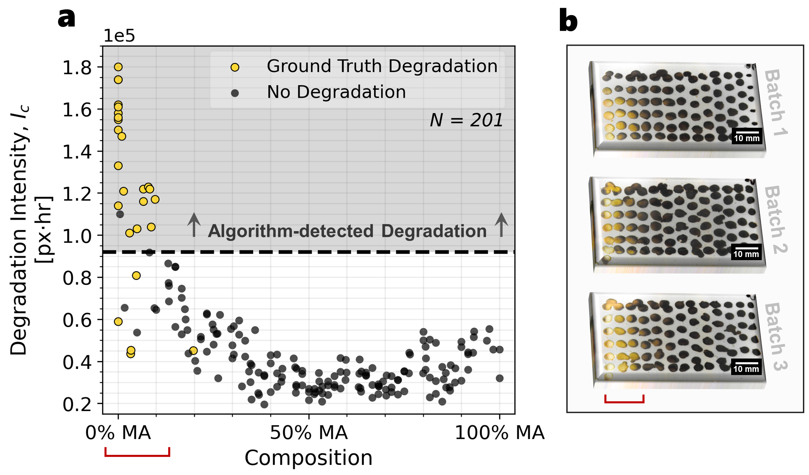

# Autocharacterization-Stability
______________________________________________

# Table of Contents
- [Package Description](#description)
- [Installation](#installation)
- [Usage](#usage)
- [Trouble-Shooting](#trouble-shooting)

# Description

This code utilizes several computer vision techniques to quickly extract and analyze accurate color vs time data of multiple chemical compounds printed using a high-throughput Multi-Material Deposition System (MMDS) such as Archerfish (AF), an MMDS built at MIT in the Accelerated Materials Development Laboratory for Sustainability under PI Tonio Buonassisi. However, due to the use of computer vision, this package can be adaptable to other material systems with different form factors. The only component of the code specific to the AF MMDS platform is the composition extraction which is a non-critical part of the code that will not affect the stability results. 

This code was developed by Eunice Aissi (Course 2 MIT Ph.D Entry class of 2022) in 2023 for the Accelerated Materials Development Laboratory for Sustainability under PI Tonio Buonassisi. This code is based on the work of Armi Tiihomen and Aleks Siemenn (Course 2 MIT PhD Entry class of 2019) 

| Folders | Description |
| ------------- | ------------------------------ |
|[Results](./Results) | An empty folder to store results.|
|[Images_Tiff](./Images_Tiff) | A folder with tiff files of the materials degradation images in chronological order. **Remove any other folders or files besides the tiff files in this folder before running the autocharacterization.** Check this file **in the computer file explorer not in an IDE** to ensure that no other files are present, especially when running on jupyterlab which creates ipybn checkpoint folders.|
|[Images_simp](./Results) |A folder with the *JPG* image of the xrite color passport called "xrite.jgp". This folder will later be populated with the individual images extracted from the tiff file|
|[Sample_set_simple](./Sample_set_simple) | A folder with an excel sheet named sample_names.xlsx with information specified by the user on: 1). the Experiment Name. 2). Start_Image_Index, a scalar that indicates which image to start the processing from. The scalar value should reflect the image's position in the first tiff file of the series. For example, Start_image_idex = 30 means that the 30th image in the first tiff file is the first image to start the image analysis from. 3). Pixel_To_Length(cm) Camera Conversion, this input is for the user's record keeping and it is not used in any calculations. 4). Experimental Notes. 5). Time_Step between images in seconds. 6). Cut, a scalar n that indicates to only extract ever nth images from the tiff files for analysis, for example, cut = 30 means every 30th image from the start image is color calibrated and used in the analysis. 6). Start Composition is the chemical composition of the starting compound in the gradient. 7). End Composition is the chemical composition of the last compound in the gradient. ( both start and end compositions are used to generate the final figures) |
|[data](./data) | a folder with images, gcode_XY.csv, and motor_speeds.txt for composition extraction|
|[figs](./figs) | an empty folder to save all the final figures|

 Files | Description |
| ------------- | ------------------------------ |
|[main.py](./main.py)| A python file to perform automatic stability measurements on the example data|
|[examples.ipynb](./examples.ipynb)| Jupyter notebook with example data to explain how to use the package. This file is interactive with lots of output figures that are used to validate each step of the process.| 
|[mainfunctions.py](./mainfunctions.py)| A python file with the high level functions for the package|
|[colorfunctions.py](./colorfunctions.py)| A python file with all the low level functions used in the [mainfunctions.py](./mainfunctions.py) file|
|[compextractorb.py](./compextractorb.py)|  A file with the function used to extract AF material compositions|
|[requirements.txt](./compextractorb.py)|  A text file with all the necessary libraries to use this package|

## Algorithm Details

This algorithm consists of two parts:
- **Color Calibration**: color calibrating the input images with a reference set of colors to improve the fidelity of the colorimetric data.
- **Instability Measurement Calculation**: calculating an instability index to quantify the change in color of each material over time. 

### Color Calibration

| Before Color Calibration | Post Color Calibration|
|---------------------------|-----------------------|
|| |

At the beginning of the degradation study, an image of a reference color chart (X-Rite Colour Checker Passport; 28 reference color patches), $I_R$, is taken under the same illumination conditions as the samples. Images at each time step, $\Omega (\Delta t)$, are transformed into the L*a*b color space and subsequently to a stable reference color space (standard observer CIE 1931 2 degrees, standard illuminant D50) by applying a 3D-thin plate spline distortion matrix $D$ defined by $I_R$ and known colors of the reference color chart:

 

 Here, $O(n,m)$ is an $n$x$m$ zero matrix, $V$ is a matrix of the color checker reference colors in the stable reference color space, $P$ is a matrix of the color checker RGB colors obtained from $I_R$, and $K$ is a distortion matrix between the color checker colors in the reference space and in $I_R$. Using the color-calibrated images and droplet pixel locations given by $\Phi$, a final array, $R(t; \widehat{X}, \widehat{Y})$ of the average color at time $t$ for perovskite semiconductor of composition FA$_{1-x}$MA$_x$PbI$_3$ is created. The color of each droplet is measured to determine a stability metric $I_c$  

**Example of an xrite image**

### Instability Measurement Calculation 

We compute the degradation intensity, $I_c$, of each HT-manufactured sample by integrating the change in color, $R$, for each sample over time, $t$:

where $T$ is the duration of the degradation and the three reflectance color channels are red, $r$, green, $g$, and blue, $b$, for each sample, $(\widehat{X},\widehat{Y})_n \in N$. High $I_c$ indicates high color change, corresponding to high degradation; $I_c$ close to zero indicates low color change and low degradation.
 

# Installation 

Package installation requirements can be found in the [requirements.txt](./requirements.txt) file.

# Usage 

**Before starting, please carefully read the folders description table as it details what files should be placed in each folder in order for the code to work.**

## Quick Start on Example Data 

A demonstration of using the automatic stability measurement package can be found in the [example.ipynb](./example.ipynb) file. The automatic stability measurement code itself can be found in the [colorfunctions.py](./colorfunctions.py) file under the `color_calibration()` definition for color calibration and in the [mainfunctions.py](./mainfunctions.py) file under the `extract_ic()` definition for stability index calculations.

A quicker demonstration can be obtained by using the main.py file. The user only needs to run the file and the example data will be automatically analyzed. 

## For Other Applications 
Input data should take the form of a tiff file with chronological images of the material samples. We provide a test dataset in the [Images_Tiff](./Images_Tiff) folder. Our images were obtained using a Thorlabs DCC1645C camera with the infrared filter removed to increase sensitivity towards dark samples. Once the data files are uploaded and the sample_names.xlsx file is made according to the instructions in the list of folders, the user must define a set of parameters that are explained in detail in the comments.  

For composition extraction, if the user is analyzing materials created using a HT synthesis system such as AF, they will be required to define a set of parameters to align the print pattern to the location of the droplets in order to obtain a good composition extraction. If the material system takes another form however, the color calibration and instability measurement functions can be adapted to fit the new application. 

# Trouble-Shooting 
- Make sure the Images_tiff folder is completely empty before you run the code. Sometimes the computer file management system will add an administrative file in the folder after it is created. Before running the code please open the file through the file manager and make sure it is completely empty. 
- To contact the file creator Eunice Aissi, email eunicea@mit.edu 
